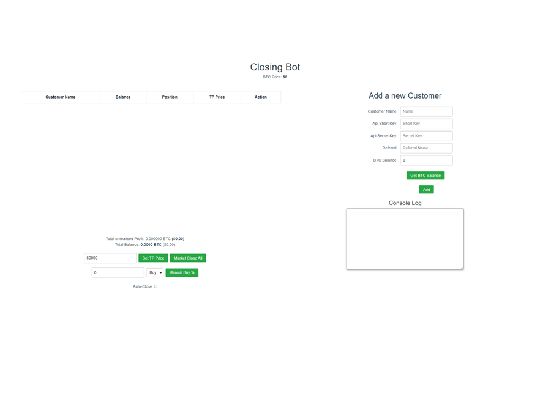

# Bybit Clients Position Manager
A clients manager created in Vue.js and using MongoDB as a database storage.

## **Features**:
- Display open position from all clients in the database
- Set a TP price (% or value) for a single/all clients
- Close the position of a single/all clients
- Buy an x amount of quantity to add to the position
- Display the profit/loss of the customers previous trades
- Display all the books a customer has rented

## **Installation**:
Run npm i in the working directory and in client folder

To run the project cd into the managers client directory and enter the following command : 
npm run serve
To start the server enter the following command in the working directory :
npm start

